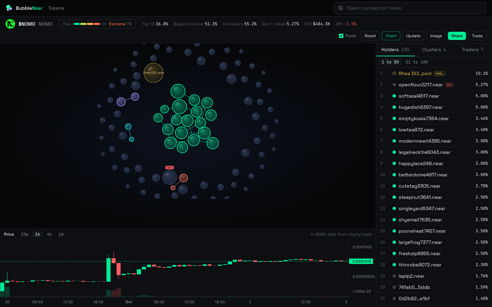
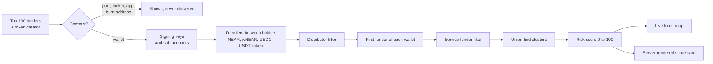
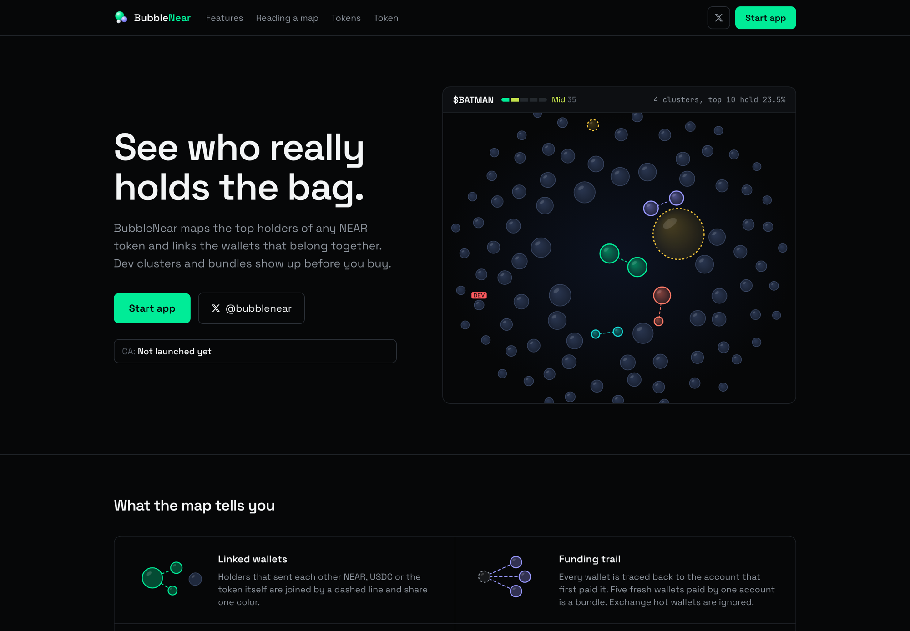
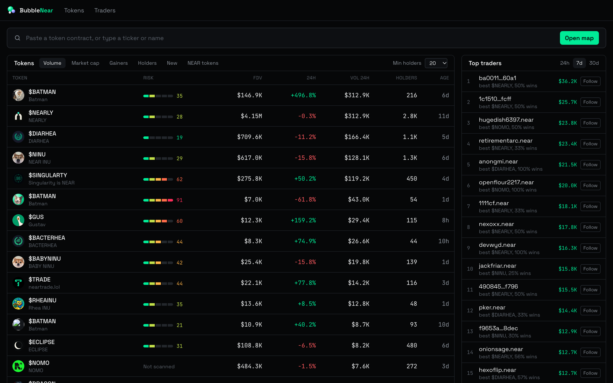
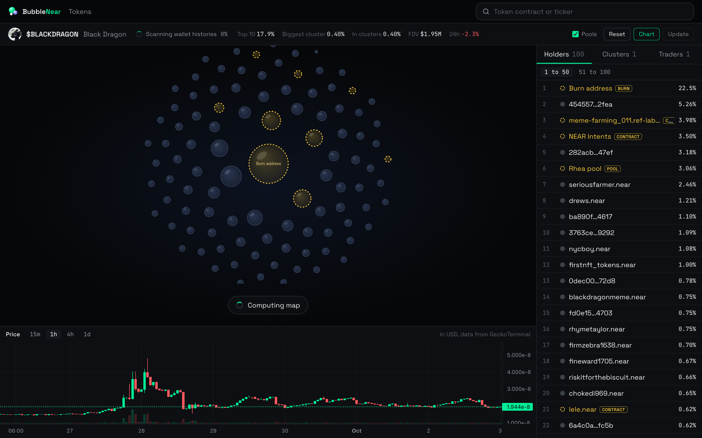
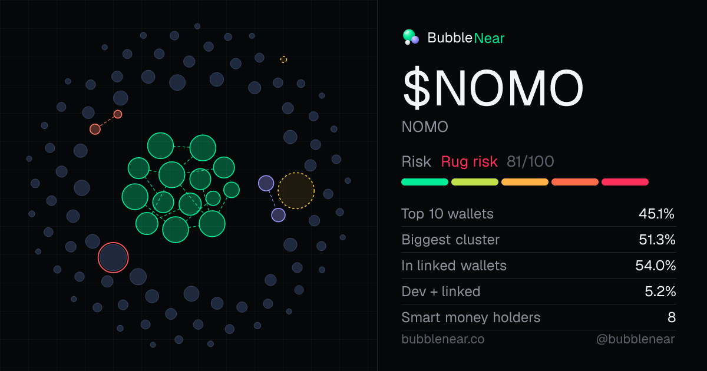
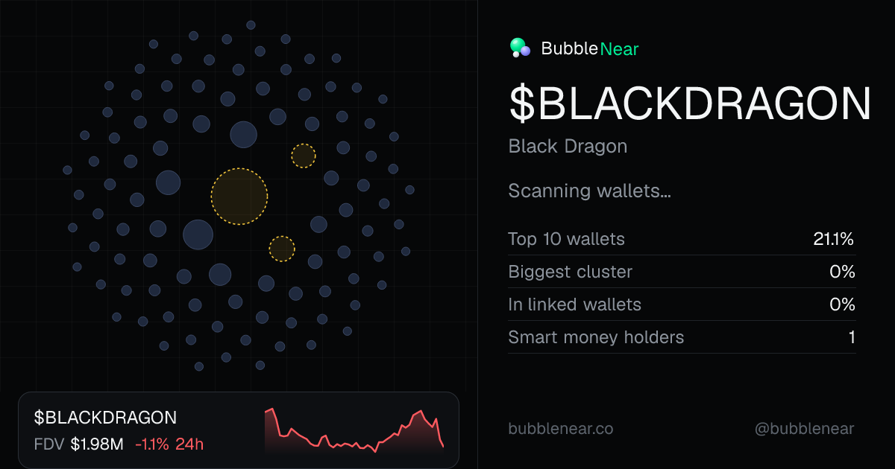

  

<h1 align="center">BubbleNear</h1>

  Bubble maps for NEAR tokens: see which top holders are really the same person.

  <a href="https://bubblenear.co">bubblenear.co</a> ·
  <a href="https://x.com/bubblenear">@bubblenear on X</a>

## What it does

- Maps the top 100 holders of any NEAR fungible token as bubbles sized by share of supply.
- Links wallets that are likely controlled by the same person, using on-chain evidence only, and groups them into clusters.
- Scores every token from 0 to 100 on five levels (Low, Mid, High, Extreme, Rug), with plain-language flags explaining the score.
- Marks the token creator (DEV), pools, lockers and other contracts, and wallets of profitable traders you follow.
- Shows a price chart next to the map and generates a 1200x630 share card for every token, used as its link preview on X.
- Lists Nearly launchpad tokens and popular NEAR tokens in a sortable terminal with risk and clustered share per token.

## How it works

A build runs in stages and publishes a usable partial map after each one, so bubbles appear within seconds and links fill in while the scan continues.

### Linking heuristics

Two holders get a link when any of these hold:

| Evidence | Signal |
|---|---|
| Same signing key | Both accounts share a full-access public key, so one keypair controls both. Strongest signal. |
| Direct transfer | NEAR, wNEAR, USDC, USDT or the token itself moved between the two holders. |
| Funded | One holder is the first funder of the other (created the account or sent it its first value). |
| Same funder | Several holders share the same first funder. |
| Sub-account | `a.bob.near` and `bob.near`, or siblings under the same non-generic parent. |

Linked wallets are merged with union-find; every connected component of two or more wallets becomes a cluster, ranked by the share of supply it holds.

### False-positive guards

Most of the work is in not linking wallets that only look related.

- **Contracts and known accounts.** Pools, lockers, the launchpad, exchanges and the burn address are detected on chain or labelled, shown on the map, and never clustered.
- **Relayers and wallet providers.** Most NEAR accounts are created by a relayer, so creators matching relayer, faucet, linkdrop or wallet-provider patterns are skipped and the first real incoming transfer is used as the funder. Generic parents (`near`, `tg`, wallet-provider namespaces) don't create sibling links.
- **Exchange and service funders.** A shared funder is dropped if it is a known exchange, has more than 3,000 transactions, or has paid 20 or more distinct accounts. Groups larger than 15 are ignored as well.
- **Airdrop distributor hubs.** A wallet that sent the token to 8 or more holders is treated as a distributor and its token transfers stop counting as links, unless the amount is at least half of the recipient's balance. That keeps bundlers (where the transfer is the recipient's whole bag) and drops airdrops.
- **Dust.** Transfers under 0.2 NEAR or wNEAR, under 1 USDC or USDT, or under 0.01% of the token's supply are ignored.
- **Spam tokens.** Any other token is ignored entirely, because spam airdrops would otherwise connect unrelated wallets.

### Risk score

The score is continuous so two tokens rarely tie. Each component ramps linearly up to a cap:

| Component | Max points | Full at |
|---|---|---|
| Largest cluster's share of supply | 40 | 25% |
| Creator plus linked wallets (launchpad tokens) | 30 | 12% |
| Top 10 wallet concentration | 20 | 50% |
| Total share held by linked wallets | 10 | 35% |
| Holders sharing one signing key | 15 | 2 or more wallets |
| Holders sharing one funder | 8 | 4 or more wallets |

The sum is capped at 100 and split into five 20-point levels. Scores are recomputed from stored evidence on startup, so a scoring change applies to every cached map without a rescan.

## Engineering highlights

**Working within free and paid API limits.** All chain data comes from FastNEAR (RPC, holders API, transaction API, transfers API). Each upstream has its own token-bucket limiter tuned to its quota, with retries and exponential backoff, and rate-limit errors are detected even when they come back inside an HTTP 200 body. View calls fail over across three JSON-RPC providers. API keys rotate automatically: when one is refused for running out of credits, the next takes over. With a key, the scanner uses the transfers API (one or two calls per wallet); without one, it falls back to reconstructing transfers from shared transaction hashes and paging back to each wallet's first transactions.

**Caching sized for a 512 MB container.** A TTL cache with in-flight de-duplication sits in front of every upstream call, so concurrent requests for the same account share one fetch, and wallet histories are reused across tokens since the same wallets hold many launchpad tokens. Transactions are immutable, so a slimmed copy (only transfer actions and transfer logs) is kept in a bounded store. Both stores evict oldest entries first.

**Job registry, warm cache and snapshot seeding.** Map builds run as background jobs; a request starts or joins a build and immediately gets the partial map, and the client polls until it is ready. At most two builds run at once. A warmer pre-scans the most traded tokens on a slower clock, and finished maps stay fresh for hours because every scan costs API credits. Finished maps are written to a seed file, and the release script pulls a snapshot from the live server into the new build, so a deploy starts warm instead of rescanning everything.

**Force map with spring physics.** The map is a d3-force simulation drawn on canvas with custom painting: shaded spheres, idle drift, marching dashed links. A radial force places the heaviest cluster in the centre and rings everything else around it by weight. Dragging a wallet pulls its cluster along through link springs, and dropped groups stay where they were put. To avoid a hairball, only a spanning tree of each cluster is drawn (Kruskal-style, strongest evidence first: same key, transfer, funded, sub-account, same funder); the full evidence list stays in the side panel. Clicks are hit-tested manually against drifted positions because the graph library drops clicks on tiny pointer movements.

**Server-rendered share cards.** Each token gets a 1200x630 PNG rendered with `next/og`. The bubble layout is computed on the server with the same forces, ring radii and spanning-tree rule as the live map, from a deterministic golden-angle start, so the same map always produces the same picture. The card adds the risk level, key stats and a 48-hour price sparkline, and doubles as the Open Graph and X preview image for every map page.

**Price data.** Charts use Nearly's own candles for launchpad tokens and fall back to GeckoTerminal's highest-volume pool for everything else, rendered with Lightweight Charts.

**Deploy.** The app runs as a single long-lived Next.js standalone server in Docker on Spaceship Hyperlift. Its builders are too small for a Next.js build, so a release script builds locally and publishes the ready-to-run server to a dedicated deploy branch whose Dockerfile only copies files.

## Tech stack

| Area | Tools |
|---|---|
| Framework | Next.js 16 (App Router, route handlers, standalone output), React 19, TypeScript |
| UI | Tailwind CSS 4, react-force-graph-2d, d3-force, Lightweight Charts |
| Share images | `next/og` (ImageResponse), server-side d3-force layout, SVG |
| Chain data | FastNEAR RPC, holders, transaction and transfers APIs; public NEAR RPC fallbacks |
| Market data | Nearly launchpad API, DexScreener, GeckoTerminal |
| Infra | Docker (node:22-slim), Spaceship Hyperlift, prebuilt deploy branch |

## Screenshots

| | |
|---|---|
|  |  |
| Landing page | Token terminal with risk per token |
|  |  |
| Bubble map with clusters | Selected wallet with its evidence |
|  |  |
| Share card, launchpad token | Share card, established NEAR token |

## Status and role

Live at [bubblenear.co](https://bubblenear.co). Designed and built end to end by me in 2026: data pipeline, clustering and risk model, map rendering, share cards, brand and deployment. The source code is private and available on request.
